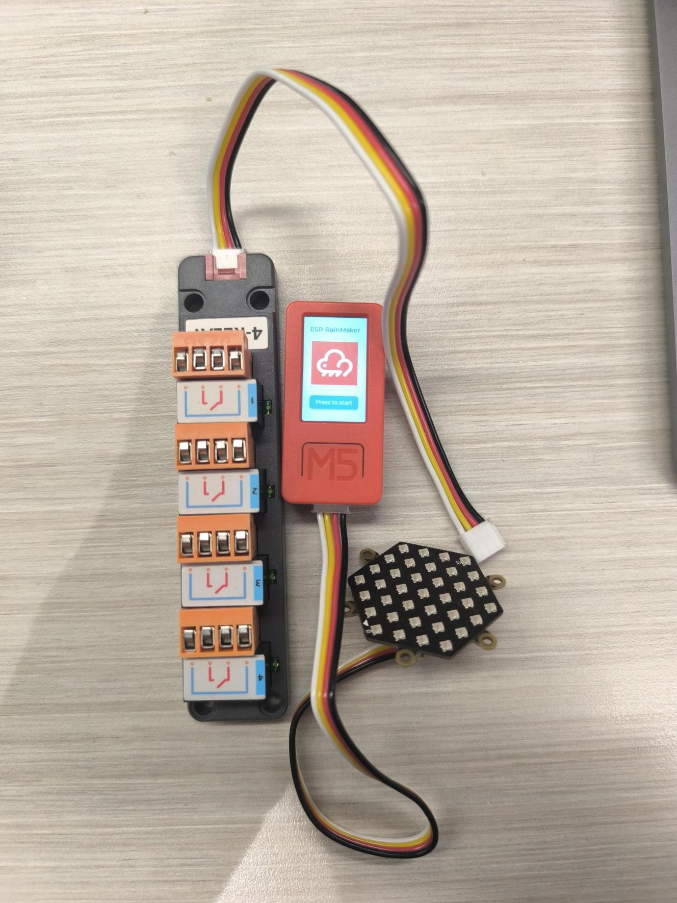
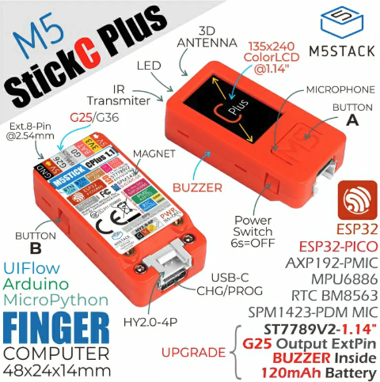
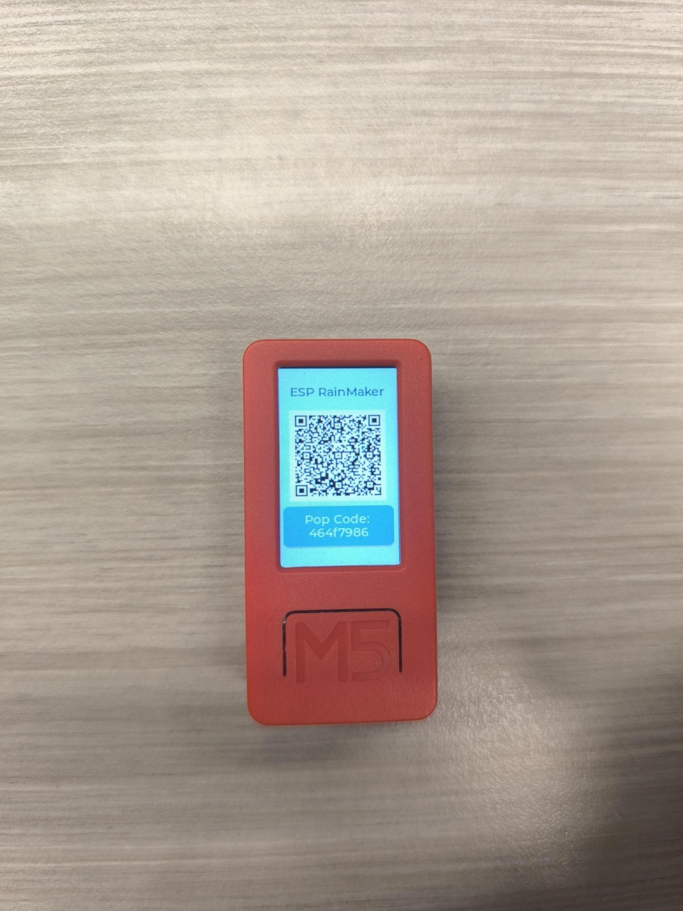
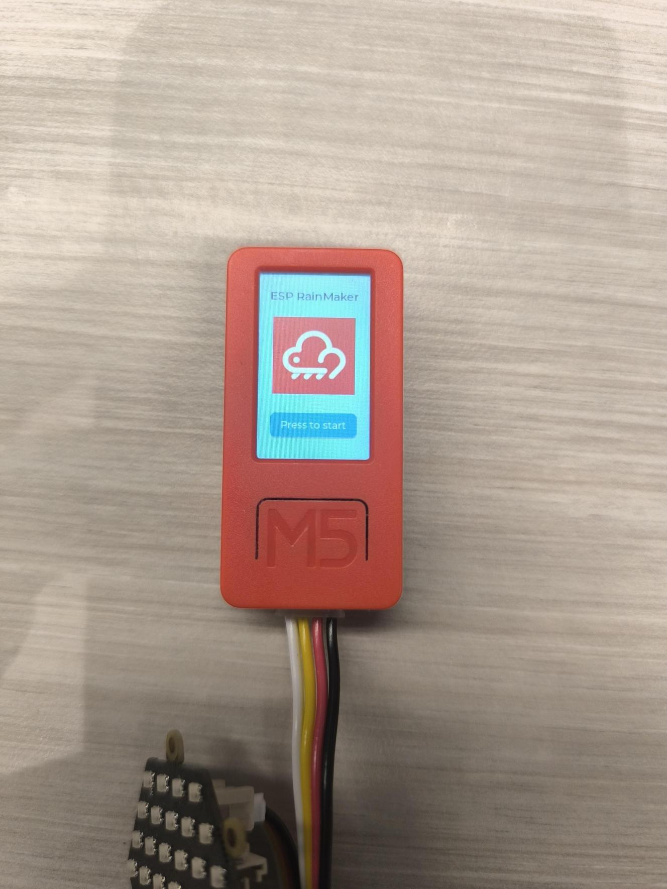
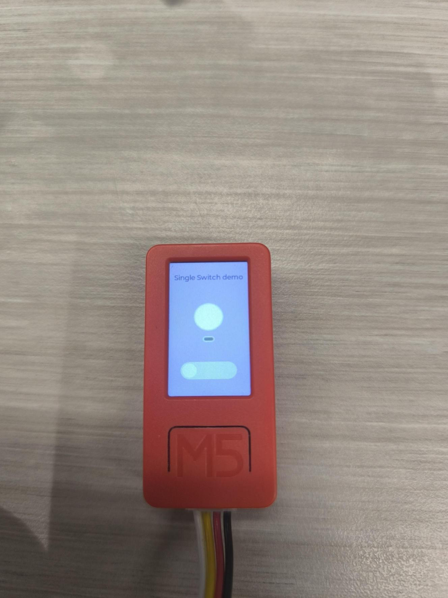
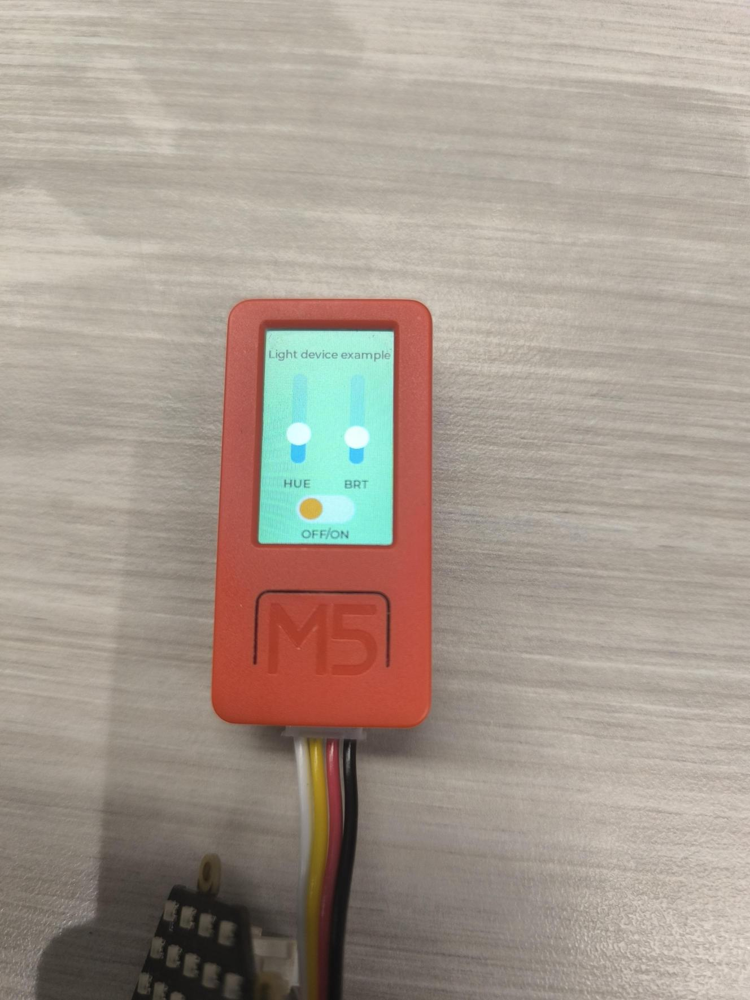
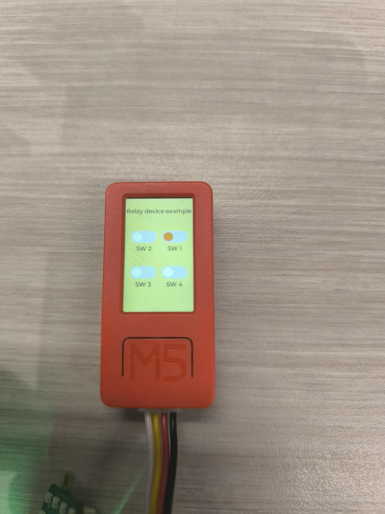

# Multi Device M5stickCplus example

# Table of Contents

1. [About project](#about-project)
2. [Getting started](#getting-started)
    - [Prerequisities](#prerequisities)
    - [Libraries/dependancies](#librariesdependancies)
    - [Installation & environment setup](#installation--environment-setup)
3. [Firmware](#firmware)
    - [Files overview](#files-overview)
4. [Usage](#usage)
    - [Features](#features)
    - [User guide](#user-guide)
5. [Contact Us](#contact-us) 

<br>

# About project
<div style="text-align: center;">

</div>

This multi-device example integrates ESP RainMaker with M5StickCPlus, offering end-users and developers a convenient way to quickly evaluate ESP RainMaker and its functionality using the M5StickCPlus—one of the many controllers available from M5Stack. This example also enables developers to explore additional features of RainMaker without requiring any circuitry setup or the purchase of dedicated electronic components. It serves as an ideal solution for testing, proof-of-concept (POC) development, or even personal projects.

M5Stack provides a wide range of ready-made hardware products based on the ESP32 series, including controllers, modules, sensors, and complete devkits. These products are designed to support rapid prototyping and can even be used in commercial applications. The objective of this example is to capitalize on M5Stack's extensive range of complete hardware solutions, enabling developers to evaluate ESP RainMaker and other ESP32 software solutions while bypassing the complexities of sourcing and assembling electronic components during the R&D and development process.

Visit M5stack latest product updates and offerings: [M5 stack products](https://shop.m5stack.com/?srsltid=AfmBOopprQu-_q28Xz7v_PWYuB3hTKTJe_9pJJflpkTyKyQ9Qs90vvHU)<br>
Visit ESP RainMaker website to find out more about Espressif's cloud solution: [ESP RainMaker official site](https://rainmaker.espressif.com/) <br>

If you have the required hardware and the binary file for this example already flashed onto the device, you can skip directly to the  [Usage](#Usage) section to learn about the demonstrations included in this example.

---

# Getting Started

In this example, we will walk through with you the setup, build and flash processes required to successfully run and manage the project. Some memory optimisation and management will also be explored. 

---

## Prerequisities

**Required Knowledge**

- Intermediate programming level in C and C++.
- Have good knowledge of terminal usage and commands.
- Familiar with the overview of RainMaker and its C API functions.
- Familiar with UI framework such as LVGL.
- Familiar with M5 m5unified API library.
- Familiar with RainMaker-cli
- Basic knowledge of terminal Git.

**Required Hardware**

1. M5stickCplus ([Buy product](https://shop.m5stack.com/products/m5stickc-plus-esp32-pico-mini-iot-development-kit)) ([Product Specs](https://docs.m5stack.com/en/core/m5stickc_plus))
2. NeoHEX RGB LED (A hexagonal board with 37 RGB LED flexible beads) ([Buy products](https://shop.m5stack.com/products/neo-hex-37-rgb-led-board-ws2812)) ([Product Specs](https://docs.m5stack.com/en/unit/neohex))
3. 4Relay (Integrated 4-way relay module) ([Buy product](https://shop.m5stack.com/products/4-relay-unit?srsltid=AfmBOooIMyEoLawaQmnAyx0P5I98r1-QDDOEn0jpBt2jfnp1_RBqVMJa)) ([Product Specs](https://docs.m5stack.com/en/unit/4relay))
4. USB-C to USB-A cable
5. Preferably a Linux or MacOS computer 

**Required Software**

1. VScode
2. ESP-IDF (**Disclaimer:** For this example to work, IDF specific version 5.1.4 is required.)

---

## Libraries/dependancies

**Here are the list of libraries and dependancies used in this project:**

**List of dependancies**

```yml
## IDF Component Manager Manifest File
dependencies:
  espressif/esp_insights: "^1.2.2"
  espressif/esp_rainmaker: "^1.5.1"
  m5stack/m5gfx: "0.1.16"
  m5stack/m5unified: "0.1.16"
  lvgl/lvgl: "9.2.0"
  espressif/arduino-esp32: "3.0.7"
  
  ## Required IDF version
  idf:
    version: ">=4.1.0"

  ## Additional dependencies
  app_reset:
    path: examples/common/app_reset
    git: https://github.com/espressif/esp-rainmaker.git
    version: 72845bc

  gpio_button:
    path: examples/common/gpio_button
    git: https://github.com/espressif/esp-rainmaker.git
    version: 72845bc
```

This list of dependancies are in the [idf_component.yml](./main/idf_component.yml). Some of these dependencies like RainMaker, insights and M5stack related dependancies are fetched from [ESP component registry](https://components.espressif.com/). 

- ESP RainMaker related dependancies:
    - `espressif/esp_rainmaker: "^1.5.1"`
- ESP Insights related dependancies:
    - `espressif/esp_insights: "^1.2.2"`
    
    Insights is enabled in this project but no demo of its usage is presented. Can be explored by developers or reviewed in another example. For more information about insights do visit: [ESP Insights SDK](https://github.com/espressif/esp-insights).

- M5stack related dependancies:
    - `m5stack/m5gfx: "0.1.16"`
    - `m5stack/m5unified: "0.1.16"`
    - `lvgl/lvgl: "9.2.0"`

    These dependancies are required to enable rendering of GUI on the StickCplus, it depends on a lightweight graphic library that is great for embedded applications. For more information of their SDK: [LVGL docs](https://docs.lvgl.io/master/).

- Arduino for ESP32 dependancies:
    - `espressif/arduino-esp32: "3.0.7"`

    Arduino, when used as a component, enables this project to run Arduino-based libraries through ESP-IDF. Since M5Stack modules and sensor libraries are written in C++, they are made compatible with Arduino. Enabling Arduino as a component allows us to work with M5Stack module and sensor libraries without the need to rewrite them to make it compatibile with IDF. This approach also lets us take advantage of chip-specific management capabilities, such as memory and power control, which are accessible through IDF but not available on the Arduino platform. However, as of this writing, only IDF version 5.1.4 is compatible to build arduino as a component successfully. 
    
    For more information, visit: [Arduino as an ESp-IDF component](https://docs.espressif.com/projects/arduino-esp32/en/latest/esp-idf_component.html)

- Additional dependancies: <br>
    ```
    app_reset:
        path: examples/common/app_reset
        git: https://github.com/espressif/esp-rainmaker.git
        version: 72845bc

    gpio_button:
        path: examples/common/gpio_button
        git: https://github.com/espressif/esp-rainmaker.git
    version: 72845bc
    ```

    Both app_reset & gpio_button are required for esp_rainmaker to function, however they are currently not hosted on ESP component registry. Therefore, they are fetched directly from [ESP RainMaker SDK](https://github.com/espressif/esp-rainmaker). 

**List of libraries in components** 

Here are the list of libraries required for this example.

- M5stack related sensor libraries:
    - [FastLED](./components/FastLED)
    - [m5_lvgl_pck](./components/m5_lvgl_pck)
    - [m5_relay_pck](./components/m5_relay_pck)


---

## Installation & environment setup

1. Before cloning this project into your local repository, you would have to setup ESP-IDF into your local machine. For detailed steps on how to setup an IDF environment, please refer to: [How to setup ESP-IDF](https://docs.espressif.com/projects/esp-idf/en/stable/esp32/get-started/index.html). 
    - **Disclaimer:** When cloning ESP_IDF, remember to specify v5.1.4: 

    ```
    git clone -b v5.1.4 --recursive https://github.com/espressif/esp-idf.git
    ```
    - If you have an existing ESP-IDF in your local environment, please switch to v5.1.4.

---

   **Skip step 2 as we are using assisted claiming by default. This step is relevant only if you are interested in using host-driven claiming. For more information, please visit [**Claiming service**](https://rainmaker.espressif.com/docs/claiming.html)** <br/>

2. A change in factory flash storage (partition) address from default 0x340000 to 0x3f7000 is required, as flashing to the default factory address 0x340000 would flash the factory cert into the wrong address, causing the program to fail on start up. Follow the steps below to handle the certificate claiming. 

- **This is only required to be done once for every device.** 

    a. Clone esp-rainmaker-cli & navigate into the folder.

    ```
    git clone https://github.com/espressif/esp-rainmaker-cli
    cd esp-rainmaker-cli
    ``` 
    
    b. Connect the device (stickcplus) into the computer & check port connection.
    
    `i.e. /dev/tty.usbserial-110`

    ```
    // Check serial port status path
    ls /dev/tty.* 
    ``` 
    c. Enter the following commend to claim the certificate. 
    
    `i.e. esp-rainmaker-cli claim  --addr 0x3f7000 /dev/tty.usbserial-110`

    ```
    esp-rainmaker-cli claim  --addr 0x3f7000 <port>
    ```

---

3. Once IDF is in your local machine and certificate claiming have been updated, clone the project and navigate into "stickcplus-multi_device" example: 

    ```
    git clone https://github.com/espressif/esp-rainmaker.git
    cd examples/m5_demos/stickcplus_multi_device
    ``` 

---

4. Initiate the respective `./export.sh` with the following command to fetch required components for FastLED, m5_lvgl & m5_relay:

    ```
    chmod +x export.sh 
    ./export.sh 
    ```

    a. Once the respective repositories have been added, edit the following files within [FastLED](./components/FastLED)
    - In the [CMakeLists.txt](./components/FastLED/CMakeLists.txt), change `arduino` to `arduino-esp32` as shown below. <br>
    **pwd:** `stickcplus_multi_device/components/FastLED/CMakeLists.txt`

    ```
    // At line 14
    idf_component_register(SRCS ${FastLED_SRCS} ${ESP32_LED_STRIP_COMPONENT_SRCS}
                       INCLUDE_DIRS "src"
                       REQUIRES arduino-esp32)
    ```

    - In [rmt_LED.c](./components/FastLED/src/platforms/esp/32/led_strip/rmt_strip.cpp), add the following headers in the file as shown below. <br>
    **pwd:** `stickcplus_multi_device/components/FastLED/src/platforms/esp/32/led_strip/rmt_strip.cpp`

    ```
    // At line 2 below #ifdef ESP32
    #pragma GCC diagnostic push 
    #pragma GCC diagnostic ignored "-Wreorder"
    ```

    b. It is time to build the project. Navigate back to `stickcplus_multi_device` directory and set-target esp32 to fetch all managed-components from the dependencies. 

    ```
    idf.py set-target esp32
    ```
    
    c. After configuring done, uncomment the following code in [m5_stack__m5gfx](./managed_components/m5stack__m5gfx/CMakeLists.txt)'s & [m5stack__m5unified](./managed_components/m5stack__m5unified/CMakeLists.txt)'s respective CMakeLists.txt in managed_components.
    - This is needed to be included for both libraries to be configured correctly as we are using arduino-esp32 components. <br> 
    **pwd for m5_stack_m5gfx:** `stickcplus_multi_device/managed_components/m5stack__m5gfx/CMakeLists.txt` <br>
    **pwd for m5stack__m5unified:** `stickcplus_multi_device/managed_components/m5stack__m5unified/CMakeLists.txt` <br>

    ```
    ### If you use arduino-esp32 components, please activate next comment line.
    list(APPEND COMPONENT_REQUIRES arduino-esp32)
    ```

    **Caution**: Do remember to save files after every change. [cltr+s or command+s]

---

5. Once the changes have been made, Navigate back to `stickcplus_multi_device` directory (If not already there) to proceed with the build,flash & monitor. 

    **Disclaimer:** Do note that a baud rate of 1500000 is used to flash the device. This may take awhile. 

    ```
    idf.py build
    idf.py flash -b 1500000 monitor
    ```

    **Tip:** To check that the firmware is flashed to the correct serial port, check with the following commend:

    ```
    ls /dev/tty.*               // To check connected serial ports
    export ESPPORT=<port path>  // To initial specific port connected to device i.e. export ESPPORT=/dev/tty.usbserial-110
    ```

---

# Firmware

## Files overview

Regarding the [main](./main) within the project, it is organised in a way that enables developers to add or remove m5 modules as required while the app_driver.cpp houses all of the driver functions
and the app_main.cpp houses the main code. It is formatted as .cpp as these are c++ files required when running arduino as a component within ESP-IDF. 

```
main
|
└───button_module
│      ..      
└───image_module
│      ..
└───interface_module
│      ..    
└───neohex_module
│      ..  
└───relay_module
│      .. 
└───app_driver.cpp      
└───app_main.cpp
└───app_priv.h
```

In order for these modules to work as intended, the required libraries would need to be added in [components](./components). If you would like to try other sensors/modules from M5stack, their libraries are available open-source on github.
You can then add them in the components directory. Consider creating submodules so that the latest version would always be fetched and it is a size efficient way to the project on your remote respo. 

```
components
.
.      
└───FastLED
└───m5_lvgl_pck  
└───m5_relay_pck
```

---

# Usage

## Features

This demo example is able to perform the following functionalities:

1. Device provisioning using QRcode/BLE Pop code entry
2. Wifi and factory reset on device
3. Single switch control 
4. Light switch control (Hue and brightness control)
5. Relay switch control
6. UI interface control
7. Remote control over native RainMaker app (Local control enabled)
8. Scenes & schedule functionality enabled

---

## User guide

The M5stickCplus device is a battery powered device that has a battery capacity of 120mAh. This makes it portable. The picture below is a reference guide on the locations of its buttons. 



### Boot up/Shut down of device [Power Switch]
- Press once to boot up
- Press and hold 6s to turn off.

### On device boot up, a provision screen will be displayed as shown below:



- Download RainMaker app on google play store or apple app store and complete the provisioning process.
- There are two ways to do the provisioning, via qrcode scanning or BLE and keying in the Pop code.
- As we are using assisted claiming, you can use Global RainMaker App or China RainMaker App to claim the device's certificate and provision it without the need to do further firmware configurations.
    - For more information visit: [RainMaker in china](https://rainmaker.espressif.com/docs/china-rainmaker/#firmware)  

- Upon successful provisioning, the QRcode & popcode would disappear, presenting the home screen as shown below:



- Click on Button A to get started.

### User interface 
- After pressing Button A on the home screen, it would transit to display the single switch demo.
- There are 3 distinct demo scenerios within this example
    1. Single switch demo 
        - Power control (on/off) of the neohex RGB LED.
    2. Light switch demo 
        - Brightness & hue control of the neohex RGB LED.
    3. Relay switch demo
        - Power control (on/off) of the 4Relay switches, enable control of actual consumer lightings.

Here is how their respective interface looks like





- Single switch and Light switch demos requires NeoHEX RGB LED module to be connected.
- Relay switch demo requires Integrated 4-way relay module to be connected. 

**Switching between demos**
- To switch between demos, double short press on Button B.

**Toggle switches on/off**
- Press Button A once.

**Select switches**
- For light switch & relay switch demo, to select a different switch, press Button B once.
- Selected switch is indicated by a orange knob. Unselected switches are indicated by a white knob. 

**Control light switch for brightness and hue**
- When brightness or hue switch is selected... 
    - Orange knob means that short pressing Button A will decrease its value.
    - Green knob means that short pressing Button A will increase its value.
    - Press and hold Button A for 1 second to change between increasing/decreasing mode.  

**Return to home screen** 
- Press and hold Button A for 5 seconds.  

**Enable wifi/factory reset**
- Press and hold Button B for 5 seconds till a wifi reset notice appear. Release Button to commence reset. 
- Continue to hold Button B for 2 more seconds till a factory reset notice appear. Release Button to commence reset.
- The device would then reset to provisioning state. 

**Remote control with RainMaker app** 
- Select the type of device on the app to control.
- Each device that is reflected on the app is linked to a specific demo. 
- If 'Single Switch' is selected and remote controlled via the app, you would need to set to 'single switch demo' on the device side in order to see the changes. 

---

# Contact us

- You may contact the ESP RainMaker support team (esp-rainmaker-support@espressif.com) for further enquires.