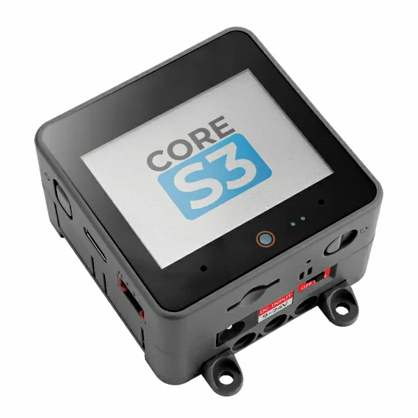
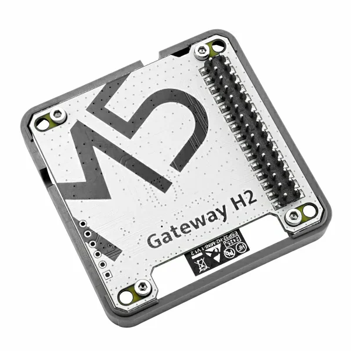

# Thread Border Router Example
This example demonstrates the functionality of a Rainmaker-based Thread Border Router (BR) device. It can be provisioned through the standard Rainmaker provisioning flow and then functions as a Thread BR. Rainmaker-over-Thread devices can be provisioned to join the Thread network and connect to the Rainmaker cloud through a NAT64 session established on the BR device.

## Hardware Required

Please use one of the following boards:
- [ESP Thread Border Router Board](https://docs.espressif.com/projects/esp-thread-br/en/latest/hardware_platforms.html#wi-fi-based-thread-border-router). It provides an integrated module of an ESP32-S3 SoC and an ESP32-H2 RCP.


- [M5Stack-CoreS3](https://shop.m5stack.com/products/m5stack-cores3-esp32s3-lotdevelopment-kit) + [Module Gateway H2](https://shop.m5stack.com/products/esp32-h2-thread-zigbee-gateway-module)

|  |  |
|---------------------------------------|-------------------------------------------------------------|

## Build and Flash firmware

### Build the RCP firmware

The Border Router supports flashing the RCP image from the host SoC.

First build the [ot_rcp](https://github.com/espressif/esp-idf/tree/master/examples/openthread/ot_rcp) example in IDF.

### Build and Flash Thread Border Router Firmware

Follow the ESP RainMaker Documentation [Get Started](https://rainmaker.espressif.com/docs/get-started.html) section to build and flash this firmware. Just note the path of this example.

If you are using IDF v5.3.1 or later, there might be an error of `#error CONFIG_LWIP_IPV6_NUM_ADDRESSES should be set to 12` when building this example. Please change the IPv6 addresses number for LwIP network interface in menuconfig and rebuild the example again.

In the building process of Thread Border Router firmware, the built RCP image in IDF path will be automatically packed into the Border Router firmware.

Build command depends on the board used:
- For ESP Thread Border Router Board:
```
idf.py set-target esp32s3 build
```
- For M5Stack CoreS3 + Module Gateway H2:
```
idf.py -D SDKCONFIG_DEFAULTS="sdkconfig.defaults;sdkconfig.defaults.m5stack" set-target esp32s3 build
```
> Note: If failed to flash M5Stack-CoreS3 board, please long press the the bottom RST button.

## What to expect in this example?

- The ESP32-H2 acts as an [OpenThread Radio-Co Processor](https://openthread.io/platforms/co-processor) and the ESP32-S3 is the host processor. They are connected by UART.
- You could set the Thread active dataset and start Thread network of the Thread Border Router with the [RainMaker CLI](https://rainmaker.espressif.com/docs/cli-setup).

### Start Thread network

After provisioning with the RainMaker phone APP, the [RainMaker CLI](https://rainmaker.espressif.com/docs/cli-setup) can be used for setting the Thread active dataset and start Thread network.

'3485187E7F68' is the rainmaker node id of the Thread border router in the following command.

- Generate a random Thread dataset, set it as active dataset and start Thread network:

```
$ esp-rainmaker-cli setparams --data '{"TBRService":{"ThreadCmd": 1}}' 3485187E7F68
Node state updated successfully.
```

- Or set a specific active dataset and start Thread network:

```
$ esp-rainmaker-cli setparams --data '{"TBRService":{"ActiveDataset": "0E080000000000010000000300001235060004001FFFE00208DE45772E58CAC8CE0708FD01321F6B80688105101CBF6F4E68CBC611B52ED9A39EFD80A9030F4F70656E5468726561642D616534370102AE470410AB7CDEB095B2C453E6CE7E7DB2BC52980C0402A0F7F8"}}' 3485187E7F68
Node state updated successfully.
```
